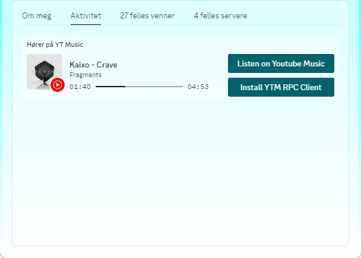
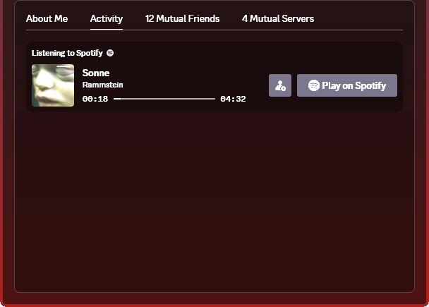
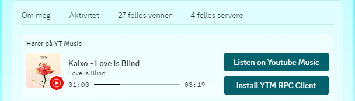

  

<h3 align="center">YT Music RPC Client</h3>

  
  
  
  

A simple <a href="https://music.youtube.com/">YouTube Music</a> (and others) Rich Presence client for <a href="https://discord.com/">Discord</a> just like the built-in Spotify one!

  

## 📝 Table of Contents
- [About](#about)
- [Usage](#usage)
- [Built Using](#built_using)
- [Authors](#authors)

## 🧐 About 
An optimized and plug and play console application that automatically retrieves your streaming service from your browser.

### What does it do? 🤔
You know the Rich Presence that you see when your friends listen to [Spotify](https://open.spotify.com/)?

  

This project replicates that but for [YouTube Music](https://music.youtube.com/) and other streaming services! It will automatically retrieve all data from your currently opened browser,
meaning that you only need to open your streaming service in your browser and have Discord open for this to work. We truly live in the golden age! ✨

#### Supported Browsers 🕸
Please feel free to commit a PR to support more browsers, since there are [Selenium](https://www.selenium.dev/selenium/docs/api/dotnet/) webdrivers for other browsers too!

| Browser | Currently Supported | Instructions |
| ------- | --------- | ----- |
|  Chrome | ✅ | [Here](docs/_instructions_chrome.md) |
|  Firefox | ❌ | - |
|  Edge | ❌ | -|
|  Internet Explorer | ❌* | - |
|  Tor | ❌ | - |
|  Opera | ❌ | - |
|  Opera GX | ❌ | - |
|  Brave | ✅ | Follow [Chrome](docs/_instructions_chrome.md) Instructions |
|  Vivaldi | ❌ | - |

* Internet explorer doesn't support any streaming service we support, hence we can not implement support for it.

#### Supported Streaming Services
Obviously the project's original scope was only YouTube Music, but after widening the projects scope support for other services have also been implemented!

| Streaming Service | Currently Supported |
| ------- | --------- |
|  YouTube Music | ✅ |
|  SoundCloud | ✅ |

### Why?! 😱
One of my friends listens to music on Spotify the entire day during work, so I can see what music he listens to. However, other people in my friendgroup use YouTube Music, which does not have rich presence support. This screamt for a solution!

#### But that solution already exists!
There are indeed already multiple implementations for this. However, most of them had one of the following issues:
- Some were using way **too much RAM** for what it should do.
- Some were **reading history files** in your browser (I am not kidding! I have actually seen this!!!).
- Some contain an **unnecessary GUI**.
- They were programmed using **complicated unoptimized libraries** to achieve their goal.

### Features 🌟

  

- Displays the artist and title! 🎙
- Shows the album (if applicable) the song is a part of! 💿
- Artwork is supported and looks better than ever! 😍
- Timestamp of where you are listening! ⌚
- Unique graphics for when you pause your songs! 🎨
- Button to listen along or download this client as well! 🎧
- So performant you will not notice you are running this program! 🌪
- Supports multiple streaming services! 🌎

## 🎈 Usage 
1. Open the Discord app. -> _This does not work in your browser!_
1. Select a browser of your choosing.
1. Go to the docs folder in this project and look for that browser. For example the Chrome instructions [here](docs/_instructions_chrome.md).
1. Follow that one instruction and you're already done. From now on you only have to boot this software and Bob's your uncle!

## ⛏️ Built Using 
- [Visual Studio](https://visualstudio.microsoft.com/) - IDE used
- [C#](https://dotnet.microsoft.com/en-us/languages/csharp) - Language used to program in
- [Selenium](https://www.selenium.dev/selenium/docs/api/dotnet/) - Used for interacting with your browser
- [Discord RPC C#](https://github.com/Lachee/discord-rpc-csharp) - C# custom implementation for Discord Rich Presence. For our project we are using a [prerelease](https://github.com/Lachee/discord-rpc-csharp/releases/tag/v1.3.0)

## ✍️ Authors 
- [@pkg-dot-zip](https://github.com/pkg-dot-zip) - Idea & Initial work.

See also the list of [contributors](https://github.com/pkg-dot-zip/MusicInBrowserDetectorForDiscord/contributors) who participated in this project.
