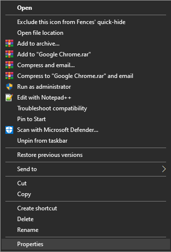
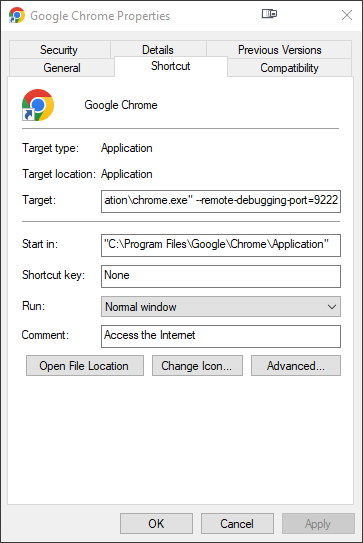

# How to use Chrome with the client?
Setting up this project for Chrome is so trivial a child of 4 could do it! 👶 Let's get right to it! 😎

## Manual (Recommended) ⭐
1. Go to your Chrome shortcut and right-click -> properties. (_**Tip**: on the **taskbar** you can hold shift and right-click to change the properties!_) 📁

  

2. Append '_--remote-debugging-port=9222_' to the target. 📃

  

3. Boot your webbrowser. 💻
4. Navigate to Youtube Music and play your favourite music. 🎧🎵
5. Boot the client and you will see your presence appear! 🤯